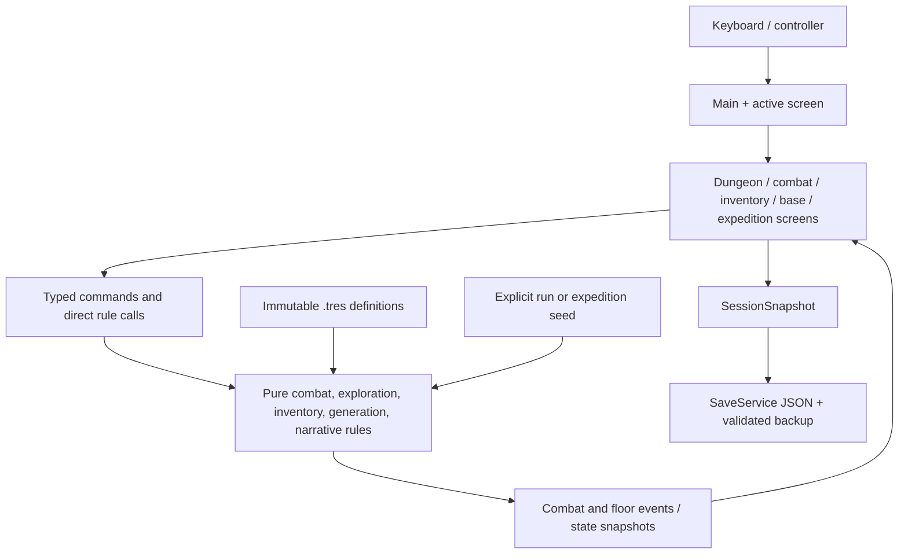

# Retro Crawler Project Handbook

> Status snapshot: August 5, 2026
> Repository: <https://github.com/mtmann213/retro-crawler>
> Local workspace used for this snapshot: `C:\Users\mtm4h\Downloads\Retro Crawler`
> Purpose: give a new human or LLM contributor enough product, technical, historical, and operational context to contribute safely without reconstructing the project from chat history.

This is the broadest project handoff document. It incorporates the planning analysis in `docs/RETRO_CRAWLER_ROADMAP_REVIEW.md`; that review remains useful rationale, while this handbook is the consolidated plan. When this document conflicts with executable code or tests, the code and tests are authoritative. When it conflicts with a newer explicit owner decision, the newer decision wins. Update this document whenever a milestone materially changes the player flow, architecture, save shape, roadmap, or project constraints.

## 1. Executive snapshot

| Area | Current state |
| --- | --- |
| Product | Original 16-bit-inspired science-fantasy RPG/dungeon crawler with modern deterministic generation and a later, optional AI layer |
| Engine | Godot 4.7.1 |
| Language | Typed GDScript |
| Renderer | GL Compatibility |
| Design viewport | 640 × 360, viewport stretch, integer scaling |
| Desktop window override | 1280 × 720 |
| Initial platforms | Windows and Linux |
| Test framework | GUT 9.7.1 plus headless integration tests |
| Playable baseline | Complete five-room Service Level vertical slice with combat, loot, boss, saves, classes, tutorial, and companion |
| Generative state | Seeded expedition plans, Wayfarer contract board, and a first locally implemented walkable generated deployment |
| Stable baseline on `main` | Milestone 10, commit `ce88ab1`, tag `v0.2.0-walkable-vertical-slice` |
| Latest published milestone | Milestone 19, commit `aae79e4`, branch `agent/milestone-19-mobile-base-map`, draft PR #18 |
| Active branch | `agent/milestone-20-walkable-expedition` |
| Active worktree | Milestone 20 prototype plus Wayfarer mouse-return hardening and the owner-directed full-screen world plan; intentionally uncommitted pending retest |
| Current automated result | 16 scripts, 115/115 tests, 44,385 assertions, no warnings |
| Roadmap posture | Stabilize the Wayfarer return, replace graph-scale rooms with the Milestone 20.5 full-screen sector foundation, consolidate, then deliver Milestone 21 as two gated slices |
| External release state | Not release-ready: outside playtests, export templates, license selection, and later content work remain |

## 2. Product vision

The ultimate direction is a highly replayable, generative RPG that produces meaningfully different exploration and story experiences on each run. Its visual and emotional reference point is the clarity, charm, color discipline, exploration, and memorable characterization associated with excellent 16-bit console RPGs, including games in the broad tradition of EarthBound, Final Fantasy VI, and Secret of Mana. It must remain an original work: do not copy identifiable characters, maps, prose, music, logos, compositions, or proprietary settings.

The intended modern differentiators are:

- Deterministically generated maps, dungeons, encounters, discoveries, and story structures.
- A persistent mobile base called the Wayfarer.
- Regions that can be revisited and changed by events and earlier decisions.
- One deeply developed original companion, Mox, rather than a shallow roster.
- Character creation, classes, appearance accents, and later build expansion.
- Optional AI-enhanced incidental interaction in a late milestone, with complete offline fallback.
- Exploration and generated stories as the highest-level experiential priorities.

The project uses a **hybrid generation model**:

1. Authored rules, content pieces, themes, constraints, and story grammar provide quality and safety.
2. Seeded procedural systems assemble those pieces into repeatable plans.
3. Pure validation rejects malformed or unwinnable results.
4. Optional language models may later render uncommon dialogue, but never own authoritative game state.

The seed is part of the product contract. A reported seed should reproduce the same structural plan and deterministic choices, which supports debugging, sharing, and fair play.

## 3. How the original blueprint evolved

The first blueprint deliberately constrained the project to a small deterministic vertical slice: one character, one five-room floor, no procedural generation, no multiple classes, and no large overworld. That was correct for proving the combat and floor-pressure loop.

Milestones 1–10 completed that baseline. The owner then explicitly expanded the direction. Character creation, three classes, a Tutorial Guild, Mox, seeded variation, expedition generation, the Wayfarer, and walkable generated deployments are therefore **intentional superseding decisions**, not scope mistakes.

Contributors should preserve the proven Service Level as a regression fixture while building the larger game around it. Do not remove deterministic tests or the authored floor simply because generated expeditions now exist.

## 4. Current player experience

### 4.1 Start and profile

- New Game opens Crawler Registration.
- The player enters a callsign of up to 18 characters.
- The player chooses Vanguard, Scavenger, or Signalist.
- The player chooses cyan, amber, or violet suit accent.
- The chosen name, class, appearance, statistics, and resources persist in the save.
- Continue restores the existing profile rather than reopening registration.

### 4.2 Intake Shelter and Tutorial Guild

- The run begins in the Intake Shelter.
- The 12-minute deterministic dungeon clock remains paused until the player leaves.
- The supply station and inventory cost no time.
- The optional Tutorial Guild is available only from the Intake Shelter and costs no dungeon time.
- Operator Coda provides five saved lessons: orientation, movement/time, combat intents, inventory/loadout, and class-specific doctrine.

### 4.3 Authored Service Level

The original floor contains:

1. **Intake Shelter** — safe start, supply station, Tutorial Guild.
2. **Broken Junction** — first visible encounter and the optional-route decision.
3. **Maintenance Cache** — optional salvage detour with a 20-second search cost.
4. **Processing Hall** — second combat gate and final approach.
5. **Warden Chamber** — three-phase boss or emergency extraction.

The player physically walks through rooms and corridors. Room entry costs 15 dungeon seconds. Encounters begin by approaching visible hostiles. Points of interest require proximity before interaction. Uncleared contacts can lock progression routes.

### 4.4 Combat

Combat uses a discrete speed-based timeline. Decisions pause the timeline. The UI exposes enemy intent, target, estimated damage, recovery, and dungeon-time cost before commitment.

Player actions:

| Skill | Role | Important cost/behavior |
| --- | --- | --- |
| Quick Strike | Fast basic attack | Generates 3 stamina; 5 dungeon seconds |
| Heavy Swing | High damage | 12 stamina, two-turn cooldown, 8 seconds |
| Brace | Defense | Halves the next incoming hit, low recovery, 5 seconds |
| Hamstring | Damage/control | 6 stamina, applies Slowed, three-turn cooldown, 5 seconds |
| Field Patch | Recovery | Limited charges, healing, 4 seconds |

Current enemies include Scrap Hound, Sentry Drone, Reclamation/Scrap Brute, and the Warden Unit. The Warden progresses through Assessment, Containment, and Purge behavior phases.

### 4.5 Rewards and progression

- Deterministic loot resolves from the run/combat seed.
- Consumables stack and can be used from inventory.
- Equipment modifies statistics once and can be removed safely.
- Unique drops cannot be acquired twice.
- Experience and level state persist.
- Player HP, resources, equipment, and rewards carry between authored encounters.

Shops, crafting, durability, random affixes, and set bonuses remain deferred.

### 4.6 Endings and Wayfarer

- The authored floor supports Warden victory and emergency extraction.
- Defeating the Warden exposes **Return to the Wayfarer** instead of leaving an actionless end panel.
- The Wayfarer navigation board presents the next deterministic expedition contract.
- The board displays theme, objective, seed, room graph, critical route, optional branches, and contact count.
- Survey Again derives another deterministic contract.
- Milestone 20 adds a local Deploy action and walkable generated layout.

### 4.7 Current generated deployment limitations

The Milestone 20 implementation is a traversal foundation, not a complete second dungeon loop. It currently:

- Converts an 8–12-sector `ExpeditionPlan` into a bounded physical room/corridor layout.
- Reuses the crawler, Mox, movement, renderer, and focus behavior.
- Tracks visited sectors and reaching the generated objective.
- Supports returning to the Wayfarer.

It does **not yet** provide generated combat encounters, resource/discovery interactions, hazards, completion rewards, expedition save persistence, or a finished multi-floor campaign loop.

## 5. Confirmed design decisions

These decisions should be treated as current unless the owner explicitly revises them:

- Use Godot 4.7.1 and typed GDScript.
- Keep the design resolution at 640 × 360 with integer viewport scaling.
- Use an original 16-bit-inspired presentation with modern readability and restrained effects.
- Preserve a deterministic, seed-driven simulation core.
- Use authored content plus procedural assembly rather than unconstrained generation.
- Use a mobile base as the long-term hub.
- Allow revisiting places.
- Make changes to revisited places event-driven.
- Focus on exploration and generated stories.
- Build one deeply developed companion; Mox is the chosen companion.
- Keep AI for later and make it optional.
- Likely AI targets are uncommon NPCs and possibly Mox, not core rules.
- Likely providers are a user-supplied API key such as Groq or a local LLM.
- Never require online AI for progression or a valid save.
- The preferred failure direction is checkpoint reversion with additional autosaves, but this is still tentative.
- Keep the Service Level as the proven authored baseline and test fixture.
- Make exploration environments fill the primary viewport. The full contract graph may be shown as a map, but must not remain the physical scale of the playable world.
- Represent each expedition sector as a full-screen or multi-screen authored template with camera-followed movement, deterministic dressing, and portal connections.
- Prove one complete generated contract before expanding campaign breadth, base complexity, story generation, or AI.
- Split generated-expedition gameplay into encounter/progression work and contract-resolution work, with separate exit tests.
- Store both generation provenance (seed and rule versions) and exact generated snapshots once expedition persistence is added.
- Build one meaningful revisit before attempting a broad persistent world.
- Treat release quality, outside playtesting, branch consolidation, asset provenance, controller/focus checks, and export smoke tests as recurring work rather than a final-only phase.

## 6. Open decisions

Do not silently resolve these without owner input when the choice would materially shape the game:

1. **Failure model:** checkpoint reload plus autosaves is favored, but the exact penalty, retry boundary, reward rollback, and abandonment behavior are not final.
2. **Generated expedition pressure:** a fresh deterministic per-contract clock derived from plan complexity is the recommended first model; the formula, time-consuming actions, pause rules, and failure threshold still need approval and simulation.
3. **Contract lifecycle:** define authoritative states and transitions for offered, accepted, deployed, objective-ready, objective-complete, extraction-ready, extracted, failed, abandoned, and recorded contracts.
4. **Generated completion and economy:** define objective interactions, extraction, banking, experience, loot, consumable recovery, optional-branch value, and duplicate-item handling.
5. **Revisits:** define stable location identity, stored plan/state, visit history, authored transformations, eligibility, and how a return visit is offered.
6. **Story campaign structure:** determine whether the campaign is finite, how expeditions form arcs around authored anchors, what advances off-screen, and what constitutes campaign completion.
7. **Companion mechanics:** deterministic field support is the recommended first role for Mox; the exact reveal, warning, interaction, route, memory, or limited combat action still needs approval.
8. **Class growth:** determine skill choices, class specialization, respec policy, and how class identity changes decisions in the same generated contract.
9. **Difficulty model:** define visible danger ratings and how campaign tier, route length, encounter/hazard density, objective complexity, class, and equipment affect challenge without scaling every enemy directly to the player.
10. **AI boundary:** select provider interface, prompt/data policy, caching, moderation, cost controls, and fallback behavior.
11. **Distribution and IP:** select final title, project license, commercial model, and confirm generated-asset distribution rights.
12. **Save migration:** version 1 currently rejects other versions; real migration steps and structure-specific version fields are required before the save schema expands.

### 6.1 Provisional planning defaults

These are the handbook's recommended starting assumptions, not irreversible owner decisions. Confirm them before implementation if a different choice would substantially change Milestones 21-24.

- **Pressure:** use a fresh deterministic clock for each contract. Derive its budget from a base allowance plus critical-route length, optional branches, objective complexity, encounter density, and difficulty modifiers. Menus and reading remain free.
- **Failure:** autosave at deployment, cleared encounters, and major objective progress; reload the latest safe checkpoint with the same seed; restore post-checkpoint rewards/state; never risk profile corruption; allow abandonment from a checkpoint.
- **Mox:** begin as deterministic field support rather than a second fully simulated combatant. Favor hazard warnings, hidden-property reveals, interaction improvements, route/objective marking, and remembered-choice callbacks.
- **Persistence:** save both the seed/provenance and the exact generated plan. Existing saves must use the saved snapshot even if later generator versions produce something different from the same seed.
- **Campaign cadence:** prototype short generated sequences around authored anchor events rather than attempting an infinite free-form campaign immediately.
- **Class growth:** after the minimum viable Wayfarer loop, test one meaningful two-way choice per class before building a broad progression tree.

### 6.2 Core product loop

The long-term loop is:

```text
Prepare on the Wayfarer
-> Select a contract
-> Explore and resolve an expedition
-> Extract, fail, or abandon
-> Bank rewards and consequences
-> Develop the crawler, Mox, loadout, and base
-> Observe event-driven world changes
-> Select a new contract or revisit
-> Advance an authored/generated story arc
```

Every transition must identify the player decision, risk, cost, reward, authoritative state change, save boundary, and narrative consequence. A feature that does not strengthen this loop should be deferred or explicitly labeled experimental.

## 7. Non-negotiable engineering requirements

### 7.1 Architecture

- Separate immutable definitions, mutable runtime state, pure rules, presentation, and persistence.
- Treat `.tres` definitions as immutable. Never put current HP, cooldowns, quantities, visited flags, or other mutable values in shared Resources.
- Pure rule classes should extend `RefCounted` where practical and must not reference sprites, audio, animations, input, or scene paths.
- Presentation submits commands and displays returned state/events; it must not calculate damage, loot, time, or legality.
- Prefer direct calls, parent/child signals, and returned event arrays. Do not introduce an unrestricted global event bus.
- Avoid gameplay Autoloads. The persistent `Main` node owns services and active screens.
- Save stable IDs and primitive values, never live Nodes or Resource instances.

### 7.2 Determinism

- Every random gameplay choice must come from an explicit seed or a seeded RNG owned by the relevant rules object.
- The same seed and command sequence must produce the same result.
- Generation must validate reachability, symmetry, required roles, objective access, extraction access, and physical bounds.
- Never use a language-model response as the authoritative source of stats, rewards, room connections, flags, or combat outcomes.

### 7.3 Input and accessibility

- Use input actions from `project.godot`, never scattered hard-coded key checks.
- Keyboard and controller must complete all mandatory actions.
- WASD must move in the world without accidentally moving UI focus.
- Focus must be visible and return to a sensible control after every modal.
- Menus and reading must not consume dungeon time.
- Focus loss must not submit actions; the game pauses and rearms input safely.

### 7.4 Viewport and visuals

- All critical UI and controls must fit 640 × 360 when populated with realistic content.
- Test the populated state, not only default placeholder labels.
- Pixel artwork uses nearest-neighbor filtering.
- World sprites remain below end-state and modal layers.
- Functional colors follow `docs/VISUAL_DIRECTION.md`.
- Do not reproduce recognizable third-party art or prose.

### 7.5 Saves

- Primary path: `user://session.json`.
- Backup path: `user://session.backup.json`.
- Settings path: `user://settings.json`.
- Save through a validated temporary file, preserve the last valid primary as backup, and reject semantically malformed data.
- Autosave only outside active action resolution.
- New save fields need defaults for older version-1 snapshots or an explicit version/migration change.

### 7.6 Tests and code quality

- Typed GDScript warnings are treated as failures by the test collector.
- Run a headless editor import before the full suite when adding or renaming scripts/classes/scenes.
- Verify the suite reports all expected scripts. GUT can return exit code 0 while warning that a parse-failing test script was skipped.
- At this snapshot the expected minimum is 16 scripts and 115 tests. Counts may only stay level or increase unless a deliberate removal is documented.
- Run `git diff --check` before staging.
- Preserve generated `.gd.uid` files for committed scripts.
- Do not commit `.godot/`, test output, or local builds.

## 8. Technical architecture



### 8.1 Application flow

`main/main.tscn` is the persistent root. `main/main.gd` owns title, character setup, pause behavior, settings, audio mode, saving, and the active `DungeonScreen`. It swaps children under `ScreenHost` rather than replacing the whole tree.

Current high-level screen flow:

```text
Title
  -> Crawler Registration (New Game only)
  -> Service Level exploration
      -> Tutorial Guild / Inventory / Announcements
      -> Combat -> Rewards -> Exploration
      -> Warden victory -> Wayfarer contract board
          -> Generated expedition deployment (Milestone 20 local)
          -> Return to Wayfarer
      -> Emergency extraction ending
  -> Pause / Save / Return to Title
```

### 8.2 Repository layout

| Path | Responsibility |
| --- | --- |
| `main/` | Persistent application root and routing |
| `data/definitions/` | Immutable Resource schemas |
| `content/` | Authored `.tres` content: floor, world, dialogue, Warden |
| `rules/combat/` | Timeline, commands, damage, effects, statuses, AI, boss phases |
| `rules/exploration/` | Floor state, room state, transitions, clock, seeded variation |
| `rules/inventory/` | Inventory, equipment, reward-session state |
| `rules/loot/` | Seeded loot resolution |
| `rules/progression/` | Experience, profile, classes, Tutorial Guild |
| `rules/narrative/` | Once-only dialogue selection and state |
| `rules/companion/` | Mox identity, memories, bond, deterministic reactions |
| `rules/generation/` | Expedition plan, generator, and current physical-layout builder |
| `scenes/combat/` | Combat presentation and Warden presenter |
| `scenes/dungeon/` | Authored exploration, generic walkable world, renderer, Mox avatar |
| `scenes/mobile_base/` | Wayfarer contract board and graph preview |
| `scenes/expedition/` | Current walkable generated deployment screen |
| `scenes/menus/` | Inventory, pause, Tutorial Guild |
| `scenes/title/` | Title and character registration |
| `services/` | Content, save, settings, audio |
| `session/` | Full saved session snapshot |
| `ui/` | Reusable components and retro theme |
| `assets/` | Original/generated project images and imports |
| `tests/rules/` | Pure rule tests and generation stress tests |
| `tests/integration/` | Screen flow, focus, save, viewport, combat integration |
| `tools/` | Headless balance simulation |
| `docs/` | Visual contract, this consolidated handbook, and the companion roadmap review |

### 8.3 Important core types

- `CombatSimulation`: validates and resolves actions into deterministic events.
- `CombatState` / `CombatantState`: mutable combat runtime state.
- `PrototypeEncounter`: current code-authored catalog for ordinary enemies, skills, and encounters.
- `FloorState` / `RoomState`: authored Service Level runtime state.
- `WalkableWorld`: reusable movement, collision, room-entry, encounter proximity, and Mox host.
- `WorldRenderer`: draws authored or generated layouts independently from rules.
- `RunVariationRules`: deterministic presentation, encounter, cache, and lighting variation for the Service Level.
- `ExpeditionPlan`: abstract validated 8–12-sector graph.
- `ExpeditionGenerator`: deterministic theme/objective/role/connection generation.
- `ExpeditionWorldBuilder`: Milestone 20 conversion from plan graph to physical grid layout.
- `RewardSession`: inventory and progression state shared across encounters.
- `CharacterProfile` / `CharacterClassRules`: sanitized profile and class statistics.
- `CompanionState` / `CompanionRules`: Mox memories, bond, directive, and once-only reactions.
- `SessionSnapshot`: versioned full authored-run save shape.
- `SaveService`: validated temporary write, primary promotion, and backup recovery.

### 8.4 Authored versus generated world data

The Service Level uses `content/worlds/service_level_layout.tres`. `WorldLayoutDefinition` contains room bounds, corridors, starting position, and tile size. Each `WorldRoomDefinition` contains display name, bounds, visual style, optional interaction point, optional encounter point, and optional locked exits.

Generated expeditions first create a pure `ExpeditionPlan`; Milestone 20 then constructs an in-memory `WorldLayoutDefinition`. This boundary is intentional. Generation correctness should remain testable without scene nodes, and the renderer should not decide connectivity.

The Milestone 20 builder is a traversal proof, not the final environmental scale. Its compressed rectangles make the graph physically walkable, but the owner has explicitly rejected tiny, mostly empty rooms as the target presentation.

#### 8.4.1 Full-screen environment target

Keep `ExpeditionPlan` as the authoritative high-level graph, then add a separate deterministic environment-assembly layer:

```text
ExpeditionPlan node
-> role/theme-compatible SectorTemplateDefinition
-> stable portal pairing
-> deterministic landmark/prop/hazard/interaction dressing
-> SectorInstanceState
-> camera-followed playable sector
```

Recommended runtime architecture:

- Each graph node becomes a full-screen or multi-screen sector rather than a miniature rectangle.
- A sector host loads the current sector's world scene and keeps a `Camera2D` centered/clamped around the crawler.
- Door, edge, elevator, or corridor portals connect stable sector IDs and transition to the paired entry socket.
- The world occupies nearly all 640 × 360; only a slim status/prompt layer remains over it.
- The contract graph remains available as a separate map/minimap and is never used as the gameplay scale.
- Authored templates define collision, boundaries, navigation paths, portal sockets, encounter sockets, interaction sockets, landmarks, large props, and dressing sockets.
- Seeded rules choose compatible templates and populate sockets. They do not generate unconstrained pixel noise or arbitrary collision.
- Stable template and dressing IDs become part of deterministic provenance and later save snapshots.
- Revisits reuse sector identity/template while applying authored transformation layers such as damage, occupation, contamination, or recovery.

Initial production target for one theme:

- One landing/entrance sector.
- Two transit variants.
- Two encounter variants.
- One resource or discovery sector.
- One hazard sector.
- One objective sector.
- Shared connector/portal treatments, prop library, palette/lighting profile, and ambient identity.

Every sector must have a recognizable silhouette, at least one landmark, purposeful paths and negative space, environmental storytelling, and enough scenery to feel inhabited or intentionally abandoned. The first scale prototype should establish density and camera feel before generated combat is integrated.

### 8.5 Save limitation relevant to future work

`SessionSnapshot.CURRENT_VERSION` is 1. The snapshot currently validates only the authored `floor_service_level` and its five room IDs. Generated expedition plan, visited sectors, generated world position, and Wayfarer state are not yet represented. Do not pretend Milestone 20 is resumable until that schema is deliberately extended and tested.

## 9. Deterministic generation contract

Current themes:

- `service_ruins`
- `arc_vault`
- `rust_garden`

Current objectives:

- `restore_relay`
- `recover_archive`
- `locate_missing_team`

Current room roles:

- entrance
- transit
- encounter
- discovery
- resource
- hazard
- objective

Every valid plan currently guarantees:

- 8–12 total rooms.
- A 5–7-room critical route.
- Entrance at the start and objective at the end.
- At least two optional rooms.
- At least two encounter rooms.
- Symmetric connections.
- Reachable objective and extraction.
- No unreachable room.
- Exact snapshot round-trip.

The Milestone 20 prototype physical builder additionally guarantees, across the tested seed sample:

- A valid `WorldLayoutDefinition`.
- Every room inside a 620 × 210 world canvas.
- No overlapping room rectangles.
- Deterministic room and corridor placement.

These bounds describe the temporary graph-scale traversal prototype. They are not a target constraint for the full-screen sector system.

Structural validity is necessary but not sufficient. Add local diagnostics for experiential quality as generated gameplay grows:

- Critical-route length, forced backtracks, optional-branch depth, and meaningful route choices.
- Longest empty traversal, encounter/reward spacing, hazard clustering, and critical-route combat load.
- Estimated completion time, optional-value ratio, objective visibility, and distinctive-landmark count.
- Room-template repetition and repeated geometry within one contract.

These measurements should flag unusual or potentially weak seeds for review; they should not automatically reject every outlier. Preserve seed and route data in a copyable local playtest report so subjective feedback can be tied to reproducible evidence.

## 10. Milestone ledger

| Milestone | Status | Commit | Result |
| --- | --- | --- | --- |
| 1. Combat prototype | Complete | `b756bcc` plus review fix `f30facd` | Godot/GUT foundation, deterministic duel, basic combat UI and soak tests |
| 2. Combat foundation | Complete | `586da11` plus review fix `c9dfcb0` | Timeline, effects, statuses, enemy AI, telegraphs, multi-enemy combat |
| 3. Reward loop | Complete | `68220a8` | Inventory, equipment, loot tables, unique items, experience, reward screen |
| 4. Dungeon exploration | Complete | `e2527b3` plus review fix `b79dc3a` | Five-room Service Level, deterministic floor clock, encounters, cache, boss access |
| 5. Boss and narrative | Complete | `0e9235c` plus fixes through `1a7c688` | Warden phases, announcements, victory and extraction endings, content validation |
| 6. Save/input/audio/UX | Complete | `4408510` plus review fix `49be93f` | Title/continue, pause, settings, keyboard/controller, versioned save and recovery |
| 7. Release-candidate pass | Complete in code | `729583a` plus fixes through `9a89502` | Backdrop, transitions, procedural audio, export presets, playtest checklist, balance tool |
| 8. Walkable Service Level | Complete | `c649679` plus focus fix `e5cbe4f` | Physical movement, original crawler sprite, saved world position |
| 9. Spatial interactions | Complete | `a6d43ca` | Proximity-based points of interest and contextual prompts |
| 10. Spatial encounters | Complete / baseline tag | `ce88ab1` | Visible hostile contacts, proximity engagement, locked routes; tagged `v0.2.0-walkable-vertical-slice` |
| 11. World graphics foundation | Complete | `7dda578` | Data-driven authored world layout and separate tiled renderer |
| 12. Visual feedback | Complete | `76c9ab5` | Original enemy sprites, room ambience, hostile animation, impact readability |
| 13. Seeded run variation | Complete | `c65098b` | Seeded lighting, hazards, encounter composition, cache quantity, combat and loot reproduction |
| 14. Character classes | Complete | `e993e9f` | Callsign, three classes, three accents, combat/world/profile persistence |
| 15. Tutorial Guild | Complete | `95d5ba0` plus polish `fa202b3` | Five optional zero-time lessons, Coda, class doctrine, saved certification |
| 16. Visual foundation | Complete | `fed43c8` | Formal visual contract, atmosphere, layering, tactical readability tests |
| 17. Companion core | Complete | `9df8789` | Mox avatar, authored personality, deterministic reactions, bond and saved memory |
| 18. Expedition generator | Complete | `2562d4c` | Validated 8–12-room seeded plans, themes, objectives, branches, 1,000-seed stress test |
| 19. Wayfarer board | Complete and published | `aae79e4` | Post-Warden transition, generated contract graph, reroll/survey, viewport fix, draft PR #18 |
| 20. Walkable generated expedition | Prototype implemented locally; owner feedback received | Uncommitted on `agent/milestone-20-walkable-expedition` | Deploy selected plan, physical layout builder, crawler/Mox traversal, survey/objective tracking, return-to-base mouse hardening; compressed rooms rejected as final presentation |

## 11. Git and collaboration state

### 11.1 Branch topology

Milestones 7–10 were consolidated into `main` and tagged as the walkable vertical-slice baseline. Milestones 11–19 currently form a stacked branch/PR chain. Milestone 19 targets Milestone 18 rather than `main`.

Current important refs:

```text
main / v0.2.0-walkable-vertical-slice -> ce88ab1 (Milestone 10)
agent/milestone-11-world-graphics-foundation
agent/milestone-12-visual-feedback
agent/milestone-13-seeded-run-variation
agent/milestone-14-character-classes
agent/milestone-15-tutorial-guild
agent/milestone-16-visual-foundation
agent/milestone-17-companion-core
agent/milestone-18-expedition-generator
agent/milestone-19-mobile-base-map -> aae79e4, draft PR #18
agent/milestone-20-walkable-expedition -> active local branch
```

The stack should be consolidated again before it becomes substantially longer. Do not open a Milestone 20 PR against `main` without either preserving the dependency chain or first merging/consolidating the prior milestones.

### 11.2 Active uncommitted Milestone 20 scope

At this snapshot, the active branch intentionally contains uncommitted owner-visible work:

Modified:

- `README.md`
- `scenes/dungeon/dungeon_screen.gd`
- `scenes/dungeon/dungeon_screen.tscn`
- `scenes/dungeon/walkable_world.gd`
- `scenes/dungeon/world_renderer.gd`
- `scenes/mobile_base/mobile_base_screen.gd`
- `scenes/mobile_base/mobile_base_screen.tscn`
- `tests/integration/test_dungeon_screen.gd`
- `tests/integration/test_save_round_trip.gd`
- `tests/rules/test_expedition_generator.gd`

New:

- `rules/generation/expedition_world_builder.gd`
- `rules/generation/expedition_world_builder.gd.uid`
- `scenes/expedition/generated_expedition_screen.gd`
- `scenes/expedition/generated_expedition_screen.gd.uid`
- `scenes/expedition/generated_expedition_screen.tscn`
- This handbook
- `docs/RETRO_CRAWLER_ROADMAP_REVIEW.md` (owner-provided planning analysis; preserve it as a companion reference)

These changes belong to the project owner. Preserve them. The normal cadence is: implement -> automated validation -> owner F5 playtest -> fix findings -> explicit commit/push instruction.

### 11.3 GitHub operational note

Git HTTPS pushes currently work. In the environment used for this snapshot, `gh auth status` reports a stale/invalid CLI token even though Git credentials and the connected GitHub app can push/create PRs. Reauthenticate with `gh auth login` only if CLI-only operations are needed. Never paste access tokens or API keys into documentation, chat, commits, or logs.

## 12. Roadmap from the current state

Milestone numbers beyond 20 are planning labels and may be adjusted after playtests. The governing product test is:

> Can one deterministic generated contract create a readable, tactically interesting, rewarding, and memorable beginning-to-ending experience?

Do not optimize for the number of generated systems until that answer is yes. Classify new scope as **first generated loop**, **first campaign**, **public demo**, **post-demo**, or **experimental**. The first generated loop excludes online/local AI, a broad story director, complex base upgrades, multiple persistent regions, full class specialization, and a large equipment catalog.

### Milestone 20 — Walkable generated deployment (current)

Goal: prove that an abstract seeded expedition can become a readable physical space using the production movement/rendering stack.

Exit criteria:

- Wayfarer Deploy opens the selected contract.
- Crawler and Mox can traverse connected generated sectors.
- Visited count and current room update.
- Reaching the objective is recognized.
- Return to Wayfarer works.
- Populated screens fit 640 × 360.
- Full suite remains green.

Owner playtesting must also record whether the critical path and optional branches are legible, the objective feels like a destination, the player can form a mental map, backtracking and empty travel are tolerable, spaces are recognizable, and Mox does not block or distract.

### Milestone 20.5 — Full-screen world foundation and consolidation

Goal: replace the graph-scale traversal prototype with the first camera-followed, environment-scale deployment baseline before combat, persistence, and contract state depend on it.

- Preserve `ExpeditionPlan` as the map/logic layer while separating it from physical presentation.
- Introduce sector templates, stable portal sockets, deterministic template selection, and deterministic dressing provenance.
- Build a camera-followed sector host where each sector fills at least one exploration screen.
- Produce a small Service Ruins template set covering entrance, transit, encounter, resource/discovery, hazard, and objective roles.
- Establish prop density, landmarks, collision, paths, interaction clearance, actor layering, and a slim exploration HUD.
- Resolve Wayfarer input, traversal, clipping, focus, controller, readability, and layout findings.
- Keep the compressed graph as an optional debug/map visualization, not the world players traverse.
- Re-run populated viewport, controller, focus, deterministic-builder, and full-suite checks.
- Publish the current graph-scale proof as a clearly labeled prototype only if useful for history; do not mistake it for the visual baseline.
- Consolidate the Milestones 11-20 branch/PR stack and tag or otherwise record the generated-traversal baseline.

Exit test: a fresh contributor can deploy multiple seeds into full-screen, camera-followed sectors; recognize sector roles and landmarks; traverse deterministic portal connections; reproduce a reported environment; and return to a mouse/keyboard/controller-operable Wayfarer.

### Milestone 21A — Generated encounters and progression gates

Goal: prove that the authored deterministic combat loop transfers cleanly into generated physical spaces.

- Map encounter roles to deterministic combat configurations.
- Add visible hostile contacts and proximity-based combat initiation.
- Carry HP/resources/equipment into and out of generated combat.
- Return the player to the correct sector and position after combat.
- Lock/unlock critical routes based on encounter completion and track cleared contacts.
- Preserve deterministic results from contract seed plus command sequence.
- Verify Mox movement and presentation near generated hostiles.

Exit test: the player can deploy, fight through one generated critical route, and reach the objective sector. Final objective interactions, rewards, saves, and contract completion remain intentionally absent.

### Milestone 21B — Contract interactions and resolution

Goal: give one generated contract a complete beginning, middle, end, and valid post-expedition state.

- Implement deterministic resource, discovery, hazard, and objective interactions.
- Add extraction, success, failure, and voluntary abandonment transitions.
- Apply the approved contract-pressure model and clearly preview all nonzero costs.
- Award deterministic loot and experience without duplicate grants.
- Return to a summary that explains what happened, what changed, what was gained, and what happens next.
- Record the final contract state and return cleanly to the Wayfarer.

Exit test: a player can accept, deploy, make route/combat/interaction decisions, complete or fail the objective, extract or abandon, receive the correct result exactly once, and continue from a valid Wayfarer state.

Before 21A/21B implementation, approve the pressure model, contract-state transitions, initial failure/checkpoint boundary, Mox's first field-support role, and future save envelope described in Sections 6 and 12.1.

### Milestone 22 — Expedition persistence and checkpoint recovery

- Extend/version `SessionSnapshot` for Wayfarer, contract, and generated expedition state.
- Store both the seed/provenance and exact generated plan/layout snapshots.
- Add separate schema, expedition-plan, physical-layout, content-catalog, and generation-rules versions where they enable targeted migration.
- Autosave at deployment, safe room entry, encounter completion, objective completion, and return to base.
- Implement the approved checkpoint recovery, rollback, backup, and abandonment rules.
- Add real migration from save version 1 if the schema version changes.

Required restore tests include deployment, ordinary traversal, post-combat, post-interaction, post-objective, missing optional fields, invalid sector IDs, plan/layout mismatch, duplicate interaction/reward prevention, corrupted-primary recovery, valid-backup recovery, version-1 migration, and exact deterministic continuation.

### Milestone 23 — Wayfarer mobile-base core

- Turn the current navigation board into a small walkable or clearly spatial persistent hub.
- Add minimum viable Navigation, Loadout, Recovery, Archive, Mox, and initially minimal/locked Systems stations.
- Make every return answer: what happened, what changed, what was gained, what decision comes next, and where the player can go.
- Establish base upgrades only where they reinforce exploration rather than idle chores.
- Make returning from an expedition feel like progression, not merely a menu reset.

Before base upgrades, define banking, healing/refill policy, carry-over resources, entry costs, currencies, failure losses, inventory capacity, and selling/dismantling. Initially avoid large crafting trees, timed construction, resource generators, repetitive repair, overlapping currencies, idle mechanics, and decorative rooms without a player function.

### Early class-growth experiment (after Milestone 23)

Give each class one choice between two directions and test the same generated contract with all three classes: Vanguard defense versus heavy offense; Scavenger discovery/resource outcomes versus consumable efficiency; Signalist hazard information versus timeline/system disruption. Keep full specialization, respec, cosmetics, and broad equipment depth in Milestone 29.

### Milestone 24A — Persistent location identity and event state

- Define stable region/location identity, origin seed, structural plan, current mutable state, visit records, discoveries, relationships, story facts, and transformation eligibility.
- Persist completion/failure history, known characters/factions, unresolved threads, danger/resources, and campaign-time metadata.
- Separate structural seed from evolving state so a place can be recognizable but changed.
- Use authored transformation sets such as Stable, Damaged, Occupied, Abandoned, Fortified, Contaminated, and Recovered before attempting free-form change.

### Milestone 24B — First meaningful revisit

- Visit one generated location, make a consequential choice, leave, complete other work, receive a reason to return, and revisit a recognizably changed version.
- Let the transformation change controlled combinations of routes, props, encounters, hazards, resources, NPC presence, objectives, dialogue, rewards, and future event eligibility.

Exit test: the player recognizes the place, understands what changed, and connects that change to an earlier action, success, or failure.

### Milestone 25 — Companion depth

- Expand Mox reactions, typed memories, relationship thresholds, and recurring story beats.
- Make field support, revisit reactions, Wayfarer interactions, and story options respond to recorded memories.
- Let Mox refer to recorded places and prior choices.
- Keep authored deterministic lines as the guaranteed experience.

Memories should have stable IDs, type, importance, interpretation, associated entity/location, expedition index, reference count, permanence, and expiration policy. Do not initially require autonomous combat AI, separate equipment/inventory, complex tactical pathfinding, or unpredictable companion-caused failure.

### Milestone 26 — Generated story director

- Build three explicit layers: authoritative facts; deterministic story structure; presentation text.
- Generate facts and quest state deterministically from validated rules.
- Assemble roles, needs, complications, discoveries, choices, reversals, consequences, closures, and open threads.
- Validate objectives and references before presentation.
- Record seed, rules, input facts, selected template, validations, enabling prior event, campaign index, and expedition index for every generated story element.
- Use authored anchor scenes to give long arcs intentional pacing.

Before broad story generation, decide campaign finiteness, arc length, anchor-event cadence, off-screen regional change, main-arc optionality, completion, post-campaign play, and what carries into a new campaign. A useful prototype cadence is three generated contracts, one authored anchor, a region change, two to four generated follow-ups, and an authored resolution.

### Milestone 27 — Content and visual expansion

- Replace abstract rectangles with standardized modular room templates and original tilesets.
- Define tile/palette rules, dimensions, collision, stable IDs, entry/exit markers, encounter/interaction/hazard/objective sockets, prop placement, lighting/audio hooks, visual-state variants, naming, provenance, and automated validation before producing volume.
- Add theme-specific props, landmarks, palette accents, hazards, animations, portraits, effects, and environmental storytelling.
- Improve crawler/enemy animation while retaining readable silhouettes.
- Expand enemies, skills, items, discoveries, and environmental storytelling.
- Continue visual QA at 640 × 360 and integer scales.

The full-screen environment pipeline begins in Milestone 20.5. Visual work then continues incrementally alongside Milestones 21-26; Milestone 27 is the focused production expansion. A planning budget per major theme is 6-10 sector templates, 3 connector variants, 3 encounter configurations, 2 hazards, 2 discoveries, 2 resource interactions, 1 objective family, 1 transformation set, several landmarks, 1 ambient-audio identity, 1 palette/lighting profile, and 1 small narrative set.

### Milestone 28 — Optional AI interaction layer

Only begin after the offline generated-story system works.

- Define a provider-neutral dialogue interface.
- Support local LLM and user-configured remote provider adapters, potentially including Groq.
- Store API keys only in local user configuration or environment variables, never saves or repository files.
- Send the minimum necessary structured context.
- Cache or summarize approved outputs where appropriate.
- Enforce timeouts, rate limits, budget limits, content boundaries, and deterministic fallback text.
- Restrict AI to nonessential uncommon-NPC dialogue, optional Mox reflections, journal prose, or flavor descriptions after required facts have already been communicated deterministically.
- Validate and filter output before display; cache accepted presentation text when appropriate.
- Never let model output directly affect saves, combat, rewards, items, statistics, connectivity, objectives, quest facts, achievements, progression, or completion.
- The AI layer must be removable without changing whether the game is coherent or completable.

### Milestone 29 — Build and progression depth

- Add class skill choices and clearer class identities.
- Expand cosmetic customization.
- Add equipment choices and limited long-term progression.
- Tune progression so generation changes decisions rather than only scenery.
- Preserve respec/failure fairness according to the final checkpoint decision.

### Milestone 30 — Release hardening

- Perform the final comprehensive branch, build, save, performance, accessibility, content, and release pass.
- Run recorded outside playtests and resolve their findings.
- Resolve onboarding, difficulty, save, focus, controller, readability, and performance findings.
- Install export templates and verify Windows/Linux packages.
- Select the project license and audit all asset provenance.
- Add save migrations, crash diagnostics, accessibility improvements, and release notes.

Release work is incremental: run outside playtests after 21B, persistence, the Wayfarer loop, and the first revisit; test controller/focus and populated viewports every milestone; rehearse migrations and exports well before release; update provenance when assets enter the repository; consolidate branches regularly; and monitor performance as generated content grows.

### 12.1 Contract state and future save envelope

Milestone 21 must use one explicit contract state machine. The planning model is:

```text
Offered -> Accepted -> Deployed -> Objective Available
-> Objective Completed -> Extraction Available -> Extracted Successfully -> Recorded

Deployed/Objective states -> Failed or Abandoned -> Recorded or resumable checkpoint
```

For every state, define legal transitions, available actions, save eligibility, reward eligibility, resumability, Wayfarer visibility, and revisit eligibility. Code must prevent double resolution and invalid transition shortcuts.

Even before Milestone 22 serializes it, Milestone 21 runtime state should have a clean future-save representation containing contract ID/seed; generation and content versions; exact plan/layout; sector and physical position; visited/cleared/completed/consumed/triggered sets; objective/extraction/clock/RNG state; player HP/resources/equipment/inventory; Mox state; contract flags; and unbanked rewards.

### 12.2 Economy, difficulty, and evidence gates

Before adding a large item/upgrades catalog, write targets for currencies, experience and level cadence, equipment replacement, consumable scarcity, healing/refill policy, contract reward tiers, optional-room value, failure losses, banking, unique items, base costs, class choices, inventory capacity, and duplicates.

Difficulty may consider campaign tier, player level, equipment rating, class, theme, critical-route length, optional-room count, encounter/hazard density, objective complexity, and special modifiers. Preserve easy, dangerous, aspirational, and unusual risk/reward contracts instead of directly matching every enemy to the player. Surface a danger rating and compare it with measured outcomes.

Add an optional local run report with seed, class, plan, route, visited sectors, fights, damage, consumables, pressure spent/remaining, rewards, failure cause, objective result, Mox events, save/checkpoint events, and final contract state. It must remain local unless the player explicitly copies/exports it.

Outside playtest and simulation gates:

- Pressure simulations: critical route only, all optional branches, fled/failed encounter, recovery action, slow reasonable menu use, multiple classes, and low/high encounter density.
- Outside playtest after 21B, Milestone 22, Milestone 23, and Milestone 24B.
- Copyable seed/state evidence for layout, difficulty, save, and narrative bugs.
- Move authored content categories out of code only when a designer needs to add/tune them without core-rule edits; likely order is enemies, skills, encounters, loot tables, interactions, hazards, discoveries, then objective families.

### 12.3 Revised sequence at a glance

1. Milestone 20 owner playtest and traversal fixes.
2. Milestone 20.5 full-screen world foundation, consolidation, and diagnostics.
3. Milestone 21A generated encounters and gates.
4. Milestone 21B interactions, objective, extraction, rewards, and pressure.
5. Milestone 22 expedition persistence and checkpoint recovery.
6. Milestone 23 minimum viable Wayfarer and economy.
7. Early two-way class-growth experiment.
8. Milestone 24A persistent location/event foundation.
9. Milestone 24B first meaningful revisit.
10. Milestone 25 Mox memory and field-support depth.
11. Milestone 26 offline generated story director.
12. Milestone 27 focused content and visual production.
13. Milestone 28 optional AI presentation.
14. Milestone 29 full build/progression depth.
15. Milestone 30 release hardening.

## 13. Risks and technical debt

| Risk/debt | Current mitigation / required response |
| --- | --- |
| Generated traversal exists without gameplay | Complete 20.5, then deliver 21A and 21B as separately testable vertical slices |
| Milestone 21 design choices could leak incompatible assumptions into later systems | Approve pressure, lifecycle, failure, Mox role, and future save envelope before dependent implementation |
| Generated state is not saved | Do not claim resume support; address in Milestone 22 |
| Regenerating from a seed may drift after rule changes | Save exact plan/layout snapshots plus seed and structure-specific versions |
| Save migrator only accepts version 1 | Add migrations before changing released schema; rehearse backup and old-save recovery |
| Stacked branches/PRs are growing | Consolidate in Milestone 20.5 and at regular integration points |
| Ordinary content catalog is partly code-authored in `PrototypeEncounter` | Move to immutable content Resources when expansion makes authoring pressure real |
| UI clipping at populated state | Keep explicit realistic viewport tests; manually inspect F5 screenshots |
| Procedural layouts may be valid but not fun | Add navigation/spacing metrics, local run reports, landmarks, and outside playtests, not only graph validation |
| Prototype rooms are tiny and visually empty | Treat the compressed layout as a debug/map proof; rebuild play around full-screen sector templates, camera movement, landmarks, props, and deterministic dressing in Milestone 20.5 |
| Economy and difficulty could become arbitrary | Define target reward, pressure, progression, and danger models before scaling content volume |
| Wayfarer could become a chore hub | Favor preparation, interpretation, and meaningful decisions; defer idle/crafting/maintenance bulk |
| Persistent regions could become broad but emotionally shallow | Build one recognizable cause-and-effect revisit before expanding world breadth |
| Mox scope could double combat/save complexity | Begin with deterministic field support and typed memories, not a second full combatant |
| Story generation may become incoherent | Use authored grammar, facts, validation, and anchor scenes before AI prose |
| AI could compromise privacy/cost/reliability | Optional adapters, local keys, strict context, fallback, no authority |
| Visual influence could become derivative | Follow original visual contract and avoid identifiable copying |
| Generated image licensing needs confirmation | Keep `LICENSES.md` current and audit before distribution |
| No public project license selected | Resolve before accepting external contributions or public release |
| Release criteria need human evidence | Use `PLAYTEST.md`; automation cannot replace outside observation |

## 14. Running, testing, and building

### 14.1 Open and play

1. Open the repository folder in Godot 4.7.1.
2. Press F5 to run `main/main.tscn`.
3. F6 runs only the currently open scene and is not the normal full-game test.

Local executable used in the owner environment:

```powershell
& 'C:\Users\mtm4h\Downloads\Godot_v4.7.1-stable_win64.exe\Godot_v4.7.1-stable_win64_console.exe' --path .
```

### 14.2 Required automated validation

When `godot` is on `PATH`:

```powershell
godot --headless --path . --editor --quit
godot --headless --path . -s addons/gut/gut_cmdln.gd -gdir=res://tests -ginclude_subdirs -gexit
git diff --check
```

With the owner’s local executable:

```powershell
& 'C:\Users\mtm4h\Downloads\Godot_v4.7.1-stable_win64.exe\Godot_v4.7.1-stable_win64_console.exe' --headless --path . --editor --quit
& 'C:\Users\mtm4h\Downloads\Godot_v4.7.1-stable_win64.exe\Godot_v4.7.1-stable_win64_console.exe' --headless --path . -s addons/gut/gut_cmdln.gd -gdir=res://tests -ginclude_subdirs -gexit
```

Inspect the text, not only the process exit code. The accepted current summary is:

```text
Scripts: 16
Tests: 115
Passing Tests: 115
Asserts: 44385
Warnings: 0
```

### 14.3 Balance simulation

```powershell
godot --headless --path . -s tools/balance_simulation.gd
```

### 14.4 Exports

Godot 4.7.1 export templates must be installed locally:

```powershell
godot --headless --path . --export-release "Windows Desktop"
godot --headless --path . --export-release "Linux"
```

Outputs go under `builds/`, which is ignored by Git.

## 15. Manual playtest routes

### 15.1 Full authored slice

1. New Game and create each class at least once.
2. Open Tutorial Guild and complete a lesson.
3. Leave Intake Shelter; confirm the clock starts.
4. Enter Broken Junction, approach enemies, and resolve combat.
5. Visit/search Maintenance Cache.
6. Clear Processing Hall.
7. Reach Warden Chamber.
8. Test Warden victory and emergency extraction on separate runs.
9. Save, quit, Continue, and verify position/profile/resources.
10. Repeat important navigation with controller.

### 15.2 Milestone 20 handoff route

1. Continue a completed Warden save or complete the floor.
2. Dismiss the final announcement.
3. Select Return to the Wayfarer.
4. Confirm the mobile-base header and all actions are visible.
5. Survey Again and confirm seed/graph changes.
6. Deploy.
7. Walk the generated corridors with WASD or D-pad.
8. Confirm Mox follows and current-sector text changes.
9. Confirm the surveyed count increases.
10. Reach the objective and confirm `OBJECTIVE REACHED`.
11. Return to Wayfarer.

For at least several seeds, record whether the critical route and optional branches are understandable; the objective reads as a destination; rooms/corridors are recognizable and varied; backtracking and empty traversal are tolerable; the contract graph must be consulted too often; and Mox blocks, overlaps, distracts, or disappears. Include the seed with every layout report.

## 16. Contribution workflow for another LLM

### Before changing anything

1. Read this handbook, `docs/RETRO_CRAWLER_ROADMAP_REVIEW.md`, `README.md`, `docs/VISUAL_DIRECTION.md`, `PLAYTEST.md`, and `LICENSES.md`. Treat the review as rationale and this handbook as the consolidated plan.
2. Run `git status -sb` and inspect the active diff.
3. Preserve uncommitted owner changes.
4. Confirm the current branch and its parent milestone.
5. Find the applicable test and source files with `rg`.
6. State assumptions when they affect product direction.

### While implementing

1. Put rules in `rules/`, immutable definitions in `data/definitions/`, authored data in `content/`, and rendering/input in `scenes/`.
2. Add the smallest pure API that supports the player-visible behavior.
3. Add deterministic rule tests first or alongside the implementation.
4. Add integration coverage for the complete screen flow.
5. Add realistic populated viewport coverage for new UI.
6. Preserve keyboard/controller focus and no-time menu behavior.
7. Reuse `WalkableWorld`, `WorldRenderer`, and existing state objects where their contracts fit.
8. Do not bypass validation to make a generated seed pass.

### Before handing off

1. Run headless import.
2. Run the full GUT suite.
3. Confirm all expected scripts loaded and no warnings occurred.
4. Run `git diff --check`.
5. Inspect `git status` for generated logs, `.godot`, or unrelated files.
6. Summarize exactly what the owner should test in F5.
7. Do not commit or push an owner-playtest milestone until explicitly requested.

### Commit and PR conventions

- Branches use `agent/milestone-N-description` in the current history.
- Commit subjects are terse, imperative summaries.
- Stage only intended files.
- Push with upstream tracking.
- Draft PRs describe what changed, why, player impact, root cause for fixes, and validation.
- When branches are stacked, target the immediate prior milestone branch unless the stack has been consolidated.

## 17. Content, licensing, and AI safety

- GUT is vendored under MIT; retain its upstream license.
- Godot is MIT and the engine binary is not committed.
- The environment backdrop, crawler, Scrap Hound, and Sentry Drone images were generated specifically for this project; provenance is recorded in `LICENSES.md`.
- Runtime music and effects are synthesized in `services/audio_director.gd` and use no external recordings.
- No public license has been selected for original project code/content.
- Do not accept or add third-party assets without license and provenance documentation.
- Do not use copyrighted book/game text or recognizable characters.
- Never commit API keys, tokens, local-LLM private data, user conversations, or secrets.

## 18. Definition of done for a milestone

A milestone is ready for owner playtest when:

- Its player-visible outcome is reachable through the normal F5 flow.
- No temporary debug-only navigation is required unless explicitly labeled.
- Deterministic rules and invalid-input cases are covered.
- Relevant integration flows are covered.
- Populated UI fits 640 × 360.
- Keyboard/controller focus remains usable.
- Save compatibility is preserved or deliberately migrated.
- Headless import and the full test suite pass with no skipped scripts or warnings.
- `git diff --check` passes.
- Deferred behavior is stated honestly in UI/docs.

A milestone is complete/published when the owner has playtested it, requested fixes are resolved, the intended files are committed and pushed, and its draft PR or consolidation path is recorded.

## 19. Source-of-truth order

Use this priority when information differs:

1. New explicit owner instruction.
2. Passing executable rules/tests and current code.
3. Current branch diff and commit history.
4. This handbook.
5. `docs/RETRO_CRAWLER_ROADMAP_REVIEW.md` for planning rationale not yet copied here.
6. `README.md`, `docs/VISUAL_DIRECTION.md`, `PLAYTEST.md`, and `LICENSES.md` within their subject areas.
7. The original development blueprint.
8. Old chat summaries or assumptions.

The blueprint remains valuable for architectural rationale and the Service Level contract, but later owner-approved milestones supersede its original post-slice exclusions.

## 20. Immediate next action

The owner playtest has now produced two material findings: Wayfarer mouse interaction failed after returning, and the graph-scale generated rooms are too small and empty to serve as the target world. The immediate work is therefore to stabilize the return transition and begin the full-screen Milestone 20.5 foundation before generated combat.

1. Preserve the Milestone 20 worktree.
2. Verify the hardened Wayfarer transition with real mouse input, keyboard, and controller; in Godot's embedded game, confirm the toolbar's **Input** toggle is enabled.
3. Run the full suite and update the accepted test/assertion baseline.
4. Keep the compressed builder as a deterministic traversal/debug proof rather than expanding its tiny rooms.
5. Commit/push only after explicit owner approval, then consolidate the stacked branches.
6. Implement the Milestone 20.5 camera/sector-template foundation and a small Service Ruins environment set.
7. Playtest environment scale, camera feel, prop density, landmarks, portal clarity, and Mox movement before generated combat.
8. Before Milestone 21A, obtain explicit owner decisions on contract pressure, lifecycle transitions, checkpoint/failure rules, Mox's initial field-support action, and the future save envelope.
9. Implement Milestone 21A and 21B as separate player-visible slices with their stated exit tests.

## 21. Suggested bootstrap prompt for another LLM

The owner can attach this file and use the following prompt:

```text
You are contributing to Retro Crawler. Read PROJECT_HANDBOOK.md completely, then read RETRO_CRAWLER_ROADMAP_REVIEW.md for supporting rationale and inspect the live repository/current git diff before proposing or changing anything. Treat newer owner instructions and executable code/tests as more authoritative than the handbook. Preserve all existing and uncommitted owner work. Follow the architecture, determinism, viewport, input, save, original-IP, and test requirements in the handbook. State the current branch, working-tree state, milestone, and relevant validation baseline before beginning. Do not commit, push, change the save schema, add online AI, or make a major product decision unless the owner explicitly authorizes it. When implementation is requested, complete the narrowest player-visible vertical slice, test it proportionately, and provide an exact F5 playtest route.
```

If the repository state has advanced beyond this August 5, 2026 snapshot, update the status, milestone ledger, active branch, validation counts, roadmap, and immediate-next-action sections as part of the next documentation pass.
